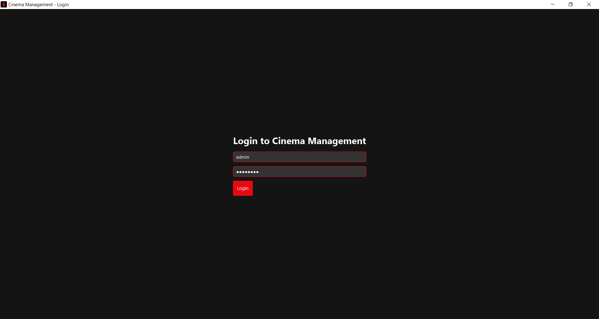
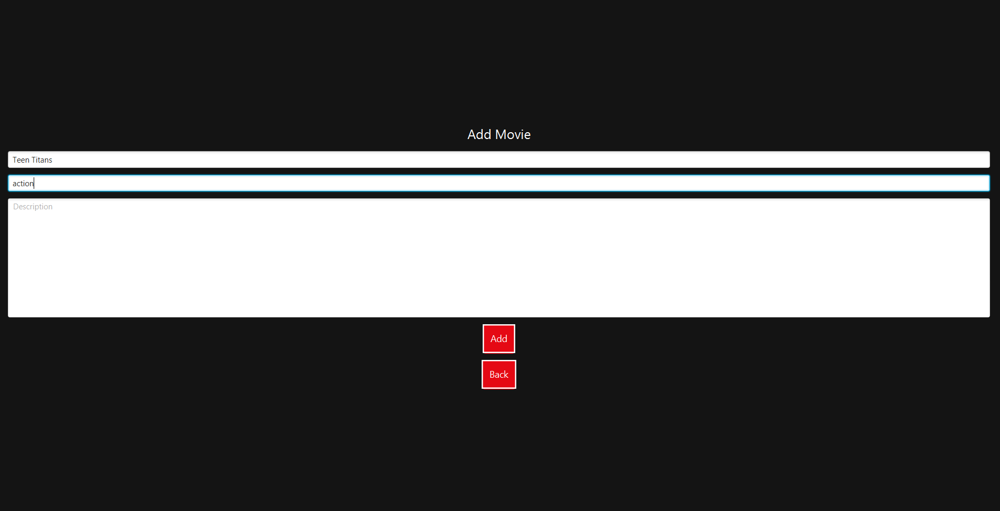
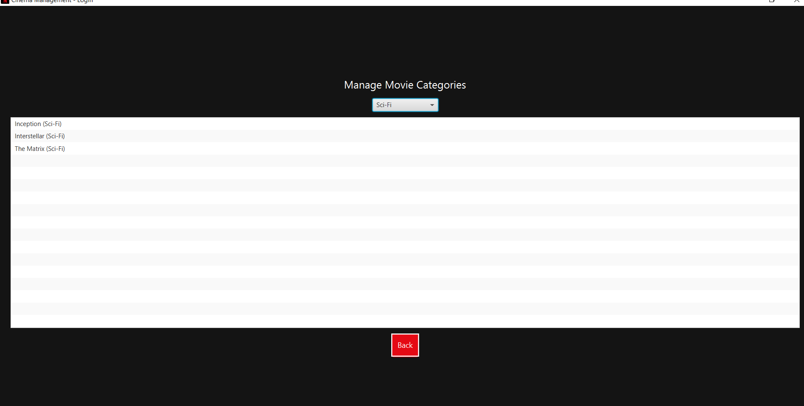

# 🎬 Cinema Management System

The **Cinema Management System** is a full-featured Java-based application developed using **JavaFX** and **File Handling** to simulate a modern cinema environment. It includes both **Admin Panel** and **User Dashboard** with core functionalities such as movie management, ticket booking, and genre categorization.

> 💻 Built with: `Java`, `JavaFX`, `OOP`, `File I/O`  
> 🎨 Inspired by: Netflix-style theme and real-world ticket systems.

---

## 📸 Screenshots

| Login Panel | Admin Home | Add Movie |
|-------------|-------------|------------|
|  |  |  |

| View Movies | Movie Categories |
|-------------|------------------|
|  |  |

---

## 🔐 Admin Panel Features

- **Login Authentication** for secure access.
- **Add Movies** with details like title, genre, duration, etc.
- **View & Delete Movies** dynamically from storage.
- **Categorize Movies by Genre** (e.g. Action, Horror, Sci-Fi).
- **Real-time File Handling** for persistent data storage.
- **Polished UI** inspired by Netflix’s layout.

---

## 🎟️ Customer Dashboard Features

- **View Movie List** sorted by genre.
- **Select Movies** to view timing and details.
- **Book Tickets** with confirmation view.
- **Favorites** feature to save preferred movies.
- **Logout** and switch account support.

---

## 🛠 Technologies Used

- `JavaFX` for GUI
- `Java File Handling` for data persistence
- `Object-Oriented Programming`
- `Modular Scene Navigation`

---

## 🗂️ Folder Structure

/CinemaManagementSystem
│
├── /src
│ ├── AdminPanel.java
│ ├── CustomerDashboard.java
│ └── Utils.java
│
├── /assets
│ └── logo.png
│
├── /screenshots
│ ├── Add.PNG
│ ├── Category.PNG
│ ├── Home.PNG
│ ├── View.PNG
│ └── loginpanel.PNG
│
└── README.md

---

## 📌 How to Run

1. Clone the repository:
   git clone https://github.com/Rahim-Ahmed15/Cinema-Management-System.git

Open in your preferred Java IDE (like Eclipse or IntelliJ).

Ensure JavaFX is properly set up.

Run the main file (Main.java or LoginPanel.java).

⭐ Future Improvements

🎟️ Online Payment Integration

📊 Admin Analytics & Statistics Dashboard

🌐 Cloud-based Database Support

📱 Mobile-friendly JavaFX version
